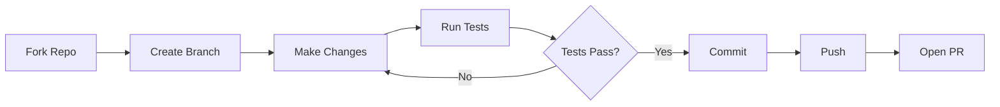
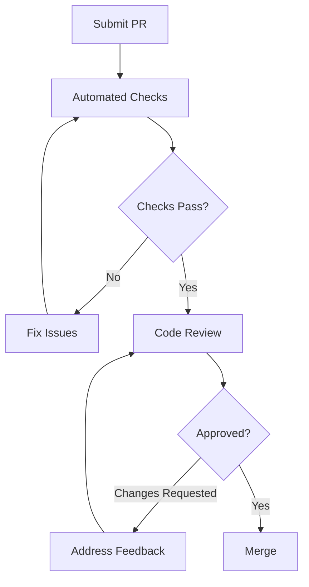

# Contributing

Thank you for your interest in contributing to nagents! This guide will help you get started.

## Getting Started

### Prerequisites

- Python 3.11 or higher
- [Poetry](https://python-poetry.org/) for dependency management
- Git for version control

### Development Setup

=== "Quick Setup"

    ```bash
    # Clone the repository
    git clone https://github.com/abi-jey/nagents.git
    cd nagents

    # Install dependencies
    poetry install

    # Install pre-commit hooks
    poetry run pre-commit install

    # Verify setup
    poetry run pytest
    ```

=== "Detailed Setup"

    ```bash
    # Clone the repository
    git clone https://github.com/abi-jey/nagents.git
    cd nagents

    # Create virtual environment and install all dependencies
    poetry install --with dev,docs  # (1)!

    # Install pre-commit hooks
    poetry run pre-commit install

    # Run the full test suite
    poetry run pytest -v

    # Run type checking
    poetry run mypy nagents

    # Build documentation locally
    poetry run mkdocs serve
    ```

    1. The `--with dev,docs` flag installs development and documentation dependencies

## Development Workflow



### Creating a Branch

```bash
# Create a feature branch
git checkout -b feature/your-feature-name

# Or a bugfix branch
git checkout -b fix/issue-description
```

!!! tip "Branch Naming"
    Use descriptive branch names:
    
    - `feature/add-streaming-support`
    - `fix/session-manager-memory-leak`
    - `docs/update-quickstart`
    - `refactor/simplify-provider-interface`

## Code Standards

### Code Style

We use [Ruff](https://github.com/astral-sh/ruff) for linting and formatting:

```bash
# Format code
poetry run ruff format .

# Lint code
poetry run ruff check .

# Fix auto-fixable issues
poetry run ruff check --fix .
```

### Type Hints

All code must include type hints. We use [mypy](https://mypy-lang.org/) for type checking:

```bash
poetry run mypy nagents
```

??? example "Type Hint Examples"

    ```python
    # Function with type hints
    def process_message(
        content: str,
        max_tokens: int | None = None,
    ) -> AsyncIterator[Event]:
        ...

    # Class with type hints
    class Agent:
        def __init__(
            self,
            provider: Provider,
            session_manager: SessionManager,
            tools: list[Tool] | None = None,
        ) -> None:
            self.provider = provider
            self.session_manager = session_manager
            self.tools = tools or []
    ```

### Docstrings

Use Google-style docstrings:

```python
def create_session(
    self,
    metadata: dict[str, Any] | None = None,
) -> Session:
    """Create a new conversation session.

    Args:
        metadata: Optional metadata to attach to the session.

    Returns:
        The newly created Session object.

    Raises:
        SessionError: If session creation fails.

    Example:
        >>> session = await manager.create_session({"user": "alice"})
        >>> print(session.id)
        'sess_abc123'
    """
    ...
```

## Testing

### Running Tests

```bash
# Run all tests
poetry run pytest

# Run with coverage
poetry run pytest --cov=nagents --cov-report=html

# Run specific test file
poetry run pytest tests/test_agent.py

# Run tests matching a pattern
poetry run pytest -k "test_session"

# Run with verbose output
poetry run pytest -v
```

### Writing Tests

=== "Unit Tests"

    ```python title="tests/test_session.py"
    import pytest
    from pathlib import Path
    from nagents import SessionManager


    @pytest.fixture
    def session_manager(tmp_path: Path) -> SessionManager:
        """Create a session manager with temporary database."""
        return SessionManager(tmp_path / "test.db")


    async def test_create_session(session_manager: SessionManager):
        """Test session creation."""
        session = await session_manager.create_session()
        
        assert session.id is not None
        assert session.created_at is not None


    async def test_session_with_metadata(session_manager: SessionManager):
        """Test session creation with metadata."""
        metadata = {"user": "test", "purpose": "testing"}
        session = await session_manager.create_session(metadata=metadata)
        
        assert session.metadata == metadata
    ```

=== "Integration Tests"

    ```python title="tests/test_integration.py"
    import pytest
    from pathlib import Path
    from nagents import Agent, SessionManager
    from nagents.providers import OpenAIProvider


    @pytest.fixture
    def agent(tmp_path: Path) -> Agent:
        """Create an agent for testing."""
        return Agent(
            provider=OpenAIProvider(model="gpt-4o-mini"),
            session_manager=SessionManager(tmp_path / "test.db"),
        )


    @pytest.mark.integration
    async def test_agent_response(agent: Agent):
        """Test that agent produces a response."""
        events = []
        
        async for event in agent.run("Say 'hello'"):
            events.append(event)
        
        # Should have at least a text event and completion
        assert any(e.type == "text_delta" for e in events)
        assert any(e.type == "message_complete" for e in events)
    ```

### Test Markers

| Marker | Description | Command |
|--------|-------------|---------|
| `@pytest.mark.unit` | Unit tests (fast, no external deps) | `pytest -m unit` |
| `@pytest.mark.integration` | Integration tests (may need API keys) | `pytest -m integration` |
| `@pytest.mark.slow` | Slow tests | `pytest -m slow` |

## Pre-commit Hooks

Pre-commit hooks run automatically on `git commit`:

```yaml title=".pre-commit-config.yaml"
repos:
  - repo: https://github.com/pre-commit/pre-commit-hooks
    hooks:
      - id: trailing-whitespace
      - id: end-of-file-fixer
      - id: check-yaml
      - id: check-added-large-files

  - repo: https://github.com/astral-sh/ruff-pre-commit
    hooks:
      - id: ruff
        args: [--fix]
      - id: ruff-format

  - repo: https://github.com/pre-commit/mirrors-mypy
    hooks:
      - id: mypy
```

Run hooks manually:

```bash
# Run on all files
poetry run pre-commit run --all-files

# Run specific hook
poetry run pre-commit run ruff --all-files
```

## Documentation

### Building Docs

```bash
# Serve docs locally with hot reload
poetry run mkdocs serve

# Build static docs
poetry run mkdocs build
```

### Documentation Style

Use Material for MkDocs features:

=== "Admonitions"

    ```markdown
    !!! note "Title"
        Note content here.

    !!! warning
        Warning without custom title.

    ??? tip "Collapsible"
        Hidden by default.
    ```

=== "Code Blocks"

    ````markdown
    ```python title="example.py" linenums="1" hl_lines="2 3"
    def hello():
        message = "Hello"  # Highlighted
        print(message)     # Highlighted
    ```
    ````

=== "Tabs"

    ```markdown
    === "Python"
        ```python
        print("Hello")
        ```

    === "JavaScript"
        ```javascript
        console.log("Hello");
        ```
    ```

## Pull Request Process

### Before Submitting

- [ ] Code follows project style guidelines
- [ ] All tests pass locally
- [ ] Pre-commit hooks pass
- [ ] Documentation is updated (if applicable)
- [ ] Commit messages are clear and descriptive

### PR Template

```markdown
## Description
Brief description of changes.

## Type of Change
- [ ] Bug fix
- [ ] New feature
- [ ] Breaking change
- [ ] Documentation update

## Testing
Describe how to test the changes.

## Checklist
- [ ] Tests added/updated
- [ ] Documentation updated
- [ ] CHANGELOG updated (if applicable)
```

### Review Process



## Issue Guidelines

### Reporting Bugs

!!! bug "Bug Report Template"
    
    **Description**: Clear description of the bug
    
    **Steps to Reproduce**:
    1. Step one
    2. Step two
    3. ...
    
    **Expected Behavior**: What should happen
    
    **Actual Behavior**: What actually happens
    
    **Environment**:
    - OS: [e.g., Ubuntu 22.04]
    - Python: [e.g., 3.11.4]
    - nagents version: [e.g., 0.1.0]

### Feature Requests

!!! tip "Feature Request Template"
    
    **Problem**: What problem does this solve?
    
    **Proposed Solution**: How should it work?
    
    **Alternatives**: Other approaches considered
    
    **Additional Context**: Any other information

## Release Process

Releases are automated via GitHub Actions when a tag is pushed:

```bash
# Create a new version tag
git tag v0.2.0
git push origin v0.2.0
```

Version numbering follows [Semantic Versioning](https://semver.org/):

- **MAJOR**: Breaking changes
- **MINOR**: New features (backwards compatible)
- **PATCH**: Bug fixes (backwards compatible)

## Getting Help

- **GitHub Issues**: For bugs and feature requests
- **GitHub Discussions**: For questions and general discussion
- **Pull Requests**: For code contributions

!!! info "Code of Conduct"
    Please be respectful and constructive in all interactions. We're all here to build something great together.

## License

By contributing, you agree that your contributions will be licensed under the project's MIT License.
