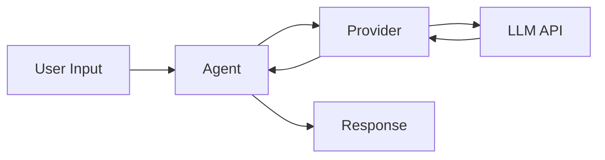

# Basic Agent

This example demonstrates how to create a simple conversational agent using nagents.

## Overview



## Simple Chat Agent

The most basic agent requires just a provider and a session manager:

```python title="basic_chat.py" linenums="1"
import asyncio
from pathlib import Path

from nagents import Agent, SessionManager
from nagents.providers import OpenAIProvider


async def main():
    # Initialize the session manager for conversation persistence
    session_manager = SessionManager(Path("sessions.db"))  # (1)!

    # Create the provider
    provider = OpenAIProvider(
        api_key="your-api-key",  # (2)!
        model="gpt-4o-mini",
    )

    # Create the agent
    agent = Agent(
        provider=provider,
        session_manager=session_manager,
        system_prompt="You are a helpful assistant.",  # (3)!
    )

    # Run a simple query
    async for event in agent.run("Hello! What can you help me with?"):
        if event.type == "text_delta":
            print(event.content, end="", flush=True)

    print()  # Newline after streaming


if __name__ == "__main__":
    asyncio.run(main())
```

1. The `SessionManager` is **required** - it handles conversation persistence
2. Use environment variables in production: `os.environ.get("OPENAI_API_KEY")`
3. The system prompt defines the agent's personality and behavior

## Interactive Chat Loop

For a more interactive experience, create a chat loop:

```python title="interactive_chat.py" linenums="1"
import asyncio
from pathlib import Path

from nagents import Agent, SessionManager
from nagents.providers import OpenAIProvider


async def chat():
    session_manager = SessionManager(Path("sessions.db"))
    provider = OpenAIProvider(model="gpt-4o-mini")

    agent = Agent(
        provider=provider,
        session_manager=session_manager,
        system_prompt="You are a friendly assistant. Be concise but helpful.",
    )

    # Create a session for this conversation
    session = await session_manager.create_session()  # (1)!

    print("Chat started! Type 'quit' to exit.\n")

    while True:
        user_input = input("You: ").strip()

        if user_input.lower() in ("quit", "exit", "q"):
            print("Goodbye!")
            break

        if not user_input:
            continue

        print("Assistant: ", end="", flush=True)

        async for event in agent.run(user_input, session_id=session.id):  # (2)!
            if event.type == "text_delta":
                print(event.content, end="", flush=True)

        print("\n")


if __name__ == "__main__":
    asyncio.run(chat())
```

1. Creating a session allows conversation history to persist across messages
2. Pass the `session_id` to maintain context between turns

## Handling Different Event Types

The agent emits various events during execution. Here's how to handle them:

=== "Basic Event Handling"

    ```python
    async for event in agent.run("Tell me a joke"):
        match event.type:
            case "text_delta":
                print(event.content, end="", flush=True)
            case "message_complete":
                print("\n--- Message complete ---")
            case "error":
                print(f"Error: {event.error}")
    ```

=== "With Metadata"

    ```python
    async for event in agent.run("Explain quantum computing"):
        match event.type:
            case "text_delta":
                print(event.content, end="", flush=True)
            case "usage":
                print(f"\nTokens used: {event.input_tokens} in, {event.output_tokens} out")
            case "message_complete":
                print(f"Stop reason: {event.stop_reason}")
    ```

=== "Full Event Logging"

    ```python
    async for event in agent.run("What is Python?"):
        match event.type:
            case "text_delta":
                print(event.content, end="", flush=True)
            case "thinking_delta":
                print(f"[Thinking: {event.content}]")
            case "usage":
                print(f"\n📊 Usage: {event.input_tokens}→{event.output_tokens} tokens")
            case "message_complete":
                print(f"✅ Complete: {event.stop_reason}")
            case "error":
                print(f"❌ Error: {event.error}")
    ```

## Configuration Options

### Agent Parameters

| Parameter | Type | Required | Description |
|-----------|------|----------|-------------|
| `provider` | `Provider` | Yes | The LLM provider to use |
| `session_manager` | `SessionManager` | Yes | Manages conversation sessions |
| `system_prompt` | `str` | No | Instructions for the agent |
| `tools` | `list[Tool]` | No | Tools the agent can use |
| `max_tokens` | `int` | No | Maximum response tokens |
| `temperature` | `float` | No | Sampling temperature (0-2) |

### Example with All Options

```python title="configured_agent.py"
agent = Agent(
    provider=provider,
    session_manager=session_manager,
    system_prompt="""You are a Python expert. 
    - Always provide code examples
    - Explain concepts clearly
    - Suggest best practices""",
    max_tokens=2048,
    temperature=0.7,
)
```

## Best Practices

!!! tip "Environment Variables"
    Never hardcode API keys. Use environment variables:
    
    ```python
    import os
    
    provider = OpenAIProvider(
        api_key=os.environ["OPENAI_API_KEY"],
        model="gpt-4o-mini",
    )
    ```

!!! tip "Error Handling"
    Always handle potential errors gracefully:
    
    ```python
    try:
        async for event in agent.run(user_input):
            if event.type == "error":
                logging.error(f"Agent error: {event.error}")
                break
            # ... handle other events
    except Exception as e:
        logging.exception("Unexpected error during agent run")
    ```

!!! tip "Session Management"
    For production applications, implement proper session lifecycle management:
    
    ```python
    # Clean up old sessions periodically
    old_sessions = await session_manager.list_sessions(
        older_than=timedelta(days=30)
    )
    for session in old_sessions:
        await session_manager.delete_session(session.id)
    ```

## Next Steps

- Learn about [Multi-Provider](multi-provider.md) setups for fallback and load balancing
- Explore [Tool Usage](tool-usage.md) to give your agent capabilities
- Check out the [Sessions Guide](../guide/sessions.md) for advanced session management
