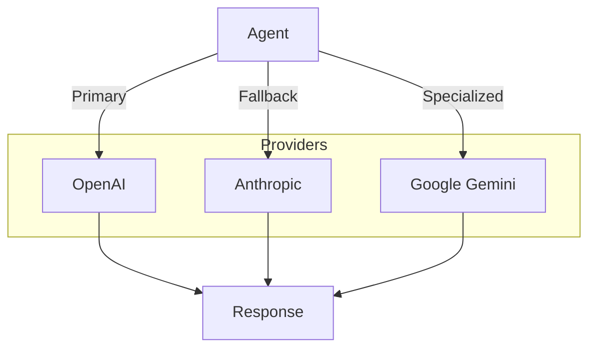

# Multi-Provider Setup

This example demonstrates how to use multiple LLM providers with nagents for fallback, comparison, and specialized use cases.

## Overview



## Provider Comparison

| Provider | Best For | Streaming | Tool Calling |
|----------|----------|-----------|--------------|
| OpenAI | General tasks, code | Yes | Yes |
| Anthropic | Analysis, writing | Yes | Yes |
| Google Gemini | Multimodal, long context | Yes | Yes |

## Basic Multi-Provider Setup

Create agents with different providers for different purposes:

```python title="multi_provider.py" linenums="1"
import asyncio
import os
from pathlib import Path

from nagents import Agent, SessionManager
from nagents.providers import AnthropicProvider, GoogleProvider, OpenAIProvider


async def main():
    session_manager = SessionManager(Path("sessions.db"))

    # OpenAI for general tasks
    openai_agent = Agent(
        provider=OpenAIProvider(
            api_key=os.environ["OPENAI_API_KEY"],
            model="gpt-4o",
        ),
        session_manager=session_manager,
        system_prompt="You are a helpful general assistant.",
    )

    # Anthropic for analysis and writing
    anthropic_agent = Agent(
        provider=AnthropicProvider(
            api_key=os.environ["ANTHROPIC_API_KEY"],
            model="claude-sonnet-4-20250514",
        ),
        session_manager=session_manager,
        system_prompt="You are an expert analyst and writer.",
    )

    # Google for multimodal tasks
    google_agent = Agent(
        provider=GoogleProvider(
            api_key=os.environ["GOOGLE_API_KEY"],
            model="gemini-2.0-flash",
        ),
        session_manager=session_manager,
        system_prompt="You are a multimodal assistant.",
    )

    # Use the appropriate agent for each task
    agents = {
        "general": openai_agent,
        "analysis": anthropic_agent,
        "multimodal": google_agent,
    }

    return agents


if __name__ == "__main__":
    asyncio.run(main())
```

## Fallback Pattern

Implement automatic fallback when a provider fails:

```python title="fallback_agent.py" linenums="1"
import asyncio
import os
from pathlib import Path

from nagents import Agent, SessionManager
from nagents.providers import AnthropicProvider, GoogleProvider, OpenAIProvider


class FallbackAgent:
    """Agent with automatic provider fallback."""

    def __init__(self, session_manager: SessionManager):
        self.session_manager = session_manager
        self.providers = [  # (1)!
            OpenAIProvider(
                api_key=os.environ.get("OPENAI_API_KEY", ""),
                model="gpt-4o-mini",
            ),
            AnthropicProvider(
                api_key=os.environ.get("ANTHROPIC_API_KEY", ""),
                model="claude-sonnet-4-20250514",
            ),
            GoogleProvider(
                api_key=os.environ.get("GOOGLE_API_KEY", ""),
                model="gemini-2.0-flash",
            ),
        ]

    async def run(self, message: str, **kwargs):
        """Run with automatic fallback on failure."""
        last_error = None

        for i, provider in enumerate(self.providers):  # (2)!
            try:
                agent = Agent(
                    provider=provider,
                    session_manager=self.session_manager,
                    **kwargs,
                )

                async for event in agent.run(message):
                    if event.type == "error":
                        raise Exception(event.error)
                    yield event

                return  # Success, exit the loop

            except Exception as e:
                last_error = e
                provider_name = type(provider).__name__
                print(f"Provider {provider_name} failed: {e}")

                if i < len(self.providers) - 1:  # (3)!
                    next_provider = type(self.providers[i + 1]).__name__
                    print(f"Falling back to {next_provider}...")

        # All providers failed
        raise RuntimeError(f"All providers failed. Last error: {last_error}")


async def main():
    session_manager = SessionManager(Path("sessions.db"))
    agent = FallbackAgent(session_manager)

    async for event in agent.run(
        "What is the capital of France?",
        system_prompt="Be concise.",
    ):
        if event.type == "text_delta":
            print(event.content, end="", flush=True)

    print()


if __name__ == "__main__":
    asyncio.run(main())
```

1. Providers are tried in order - put your preferred/cheapest provider first
2. Iterate through providers until one succeeds
3. Only print fallback message if there are more providers to try

## Provider Router

Route requests to different providers based on task type:

=== "Router Class"

    ```python title="provider_router.py"
    from enum import Enum
    from pathlib import Path

    from nagents import Agent, SessionManager
    from nagents.providers import AnthropicProvider, GoogleProvider, OpenAIProvider


    class TaskType(Enum):
        CODE = "code"
        ANALYSIS = "analysis"
        CREATIVE = "creative"
        GENERAL = "general"


    class ProviderRouter:
        """Route requests to optimal providers based on task type."""

        def __init__(self, session_manager: SessionManager):
            self.session_manager = session_manager
            self._agents: dict[TaskType, Agent] = {}

        def _get_agent(self, task_type: TaskType) -> Agent:
            if task_type not in self._agents:
                self._agents[task_type] = self._create_agent(task_type)
            return self._agents[task_type]

        def _create_agent(self, task_type: TaskType) -> Agent:
            configs = {
                TaskType.CODE: {
                    "provider": OpenAIProvider(model="gpt-4o"),
                    "system_prompt": "You are an expert programmer.",
                },
                TaskType.ANALYSIS: {
                    "provider": AnthropicProvider(model="claude-sonnet-4-20250514"),
                    "system_prompt": "You are a thorough analyst.",
                },
                TaskType.CREATIVE: {
                    "provider": AnthropicProvider(model="claude-sonnet-4-20250514"),
                    "system_prompt": "You are a creative writer.",
                },
                TaskType.GENERAL: {
                    "provider": GoogleProvider(model="gemini-2.0-flash"),
                    "system_prompt": "You are a helpful assistant.",
                },
            }

            config = configs[task_type]
            return Agent(
                provider=config["provider"],
                session_manager=self.session_manager,
                system_prompt=config["system_prompt"],
            )

        async def run(self, message: str, task_type: TaskType):
            agent = self._get_agent(task_type)
            async for event in agent.run(message):
                yield event
    ```

=== "Usage"

    ```python
    async def main():
        session_manager = SessionManager(Path("sessions.db"))
        router = ProviderRouter(session_manager)

        # Code task -> OpenAI
        print("Code task:")
        async for event in router.run(
            "Write a Python function to calculate fibonacci numbers",
            TaskType.CODE,
        ):
            if event.type == "text_delta":
                print(event.content, end="")

        print("\n\nAnalysis task:")
        # Analysis task -> Anthropic
        async for event in router.run(
            "Analyze the pros and cons of microservices architecture",
            TaskType.ANALYSIS,
        ):
            if event.type == "text_delta":
                print(event.content, end="")
    ```

## Parallel Provider Comparison

Compare responses from multiple providers simultaneously:

```python title="parallel_comparison.py" linenums="1"
import asyncio
from pathlib import Path

from nagents import Agent, SessionManager
from nagents.providers import AnthropicProvider, GoogleProvider, OpenAIProvider


async def get_response(agent: Agent, message: str, name: str) -> dict:
    """Get complete response from an agent."""
    response_text = ""

    async for event in agent.run(message):
        if event.type == "text_delta":
            response_text += event.content
        elif event.type == "usage":
            tokens = event.input_tokens + event.output_tokens

    return {
        "provider": name,
        "response": response_text,
        "tokens": tokens if "tokens" in dir() else None,
    }


async def compare_providers(message: str):
    """Compare responses from multiple providers."""
    session_manager = SessionManager(Path("sessions.db"))

    agents = {
        "OpenAI": Agent(
            provider=OpenAIProvider(model="gpt-4o-mini"),
            session_manager=session_manager,
        ),
        "Anthropic": Agent(
            provider=AnthropicProvider(model="claude-sonnet-4-20250514"),
            session_manager=session_manager,
        ),
        "Google": Agent(
            provider=GoogleProvider(model="gemini-2.0-flash"),
            session_manager=session_manager,
        ),
    }

    # Run all providers in parallel
    tasks = [
        get_response(agent, message, name) for name, agent in agents.items()
    ]

    results = await asyncio.gather(*tasks, return_exceptions=True)  # (1)!

    # Display results
    for result in results:
        if isinstance(result, Exception):
            print(f"Error: {result}")
        else:
            print(f"\n{'=' * 50}")
            print(f"Provider: {result['provider']}")
            print(f"{'=' * 50}")
            print(result["response"][:500])  # First 500 chars
            if result["tokens"]:
                print(f"\nTokens: {result['tokens']}")


if __name__ == "__main__":
    asyncio.run(compare_providers("Explain quantum entanglement in simple terms."))
```

1. `return_exceptions=True` ensures one failure doesn't cancel others

## Best Practices

!!! tip "Cost Optimization"
    Route simpler tasks to cheaper providers:
    
    ```python
    def select_provider(complexity: str) -> Provider:
        if complexity == "simple":
            return GoogleProvider(model="gemini-2.0-flash")  # Cheapest
        elif complexity == "medium":
            return OpenAIProvider(model="gpt-4o-mini")
        else:
            return AnthropicProvider(model="claude-sonnet-4-20250514")  # Best quality
    ```

!!! warning "API Key Management"
    Store API keys securely and validate they exist:
    
    ```python
    import os

    def get_available_providers() -> list[Provider]:
        providers = []
        
        if key := os.environ.get("OPENAI_API_KEY"):
            providers.append(OpenAIProvider(api_key=key, model="gpt-4o-mini"))
        
        if key := os.environ.get("ANTHROPIC_API_KEY"):
            providers.append(AnthropicProvider(api_key=key, model="claude-sonnet-4-20250514"))
        
        if key := os.environ.get("GOOGLE_API_KEY"):
            providers.append(GoogleProvider(api_key=key, model="gemini-2.0-flash"))
        
        if not providers:
            raise ValueError("No API keys configured!")
        
        return providers
    ```

!!! info "Session Sharing"
    The same `SessionManager` can be shared across multiple agents. Sessions are isolated by ID, so different agents can maintain separate conversation histories.

## Next Steps

- Learn about [Tool Usage](tool-usage.md) to extend agent capabilities
- Explore the [Providers Guide](../guide/providers.md) for detailed provider documentation
- Check [Configuration](../getting-started/configuration.md) for environment setup
