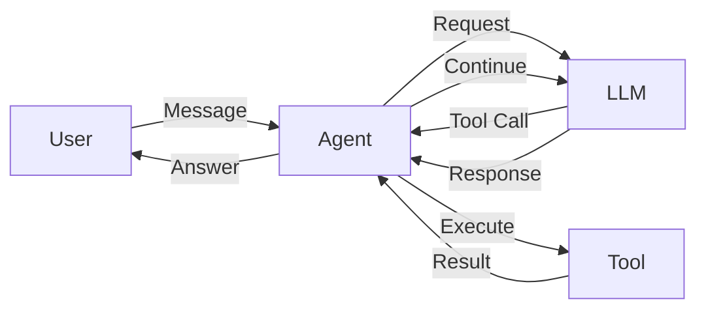

# Tool Usage

This example demonstrates how to give your agents capabilities through tools.

## Overview

Tools allow agents to interact with external systems, perform calculations, access data, and more.



## Basic Tool Definition

Define tools using Python functions with type hints:

```python title="basic_tools.py" linenums="1"
import asyncio
from datetime import datetime
from pathlib import Path

from nagents import Agent, SessionManager, Tool
from nagents.providers import OpenAIProvider


# Define a simple tool
def get_current_time() -> str:  # (1)!
    """Get the current date and time."""
    return datetime.now().strftime("%Y-%m-%d %H:%M:%S")


def calculate(expression: str) -> str:  # (2)!
    """
    Evaluate a mathematical expression.
    
    Args:
        expression: A mathematical expression to evaluate (e.g., "2 + 2 * 3")
    """
    try:
        # Safe evaluation of mathematical expressions
        allowed_chars = set("0123456789+-*/.() ")
        if not all(c in allowed_chars for c in expression):
            return "Error: Invalid characters in expression"
        result = eval(expression)  # noqa: S307
        return str(result)
    except Exception as e:
        return f"Error: {e}"


async def main():
    session_manager = SessionManager(Path("sessions.db"))
    
    # Create tools from functions
    tools = [
        Tool.from_function(get_current_time),  # (3)!
        Tool.from_function(calculate),
    ]
    
    agent = Agent(
        provider=OpenAIProvider(model="gpt-4o-mini"),
        session_manager=session_manager,
        system_prompt="You are a helpful assistant with access to tools.",
        tools=tools,
    )
    
    # The agent will automatically use tools when appropriate
    async for event in agent.run("What time is it, and what is 15% of 85?"):
        if event.type == "text_delta":
            print(event.content, end="", flush=True)
        elif event.type == "tool_call":
            print(f"\n[Calling tool: {event.name}]")
        elif event.type == "tool_result":
            print(f"[Tool result: {event.result}]\n")
    
    print()


if __name__ == "__main__":
    asyncio.run(main())
```

1. Simple tools can be synchronous functions with no arguments
2. Tools with parameters should include docstrings describing the arguments
3. `Tool.from_function` automatically extracts name, description, and parameters from the function

## Async Tools

For I/O operations, use async tools:

```python title="async_tools.py" linenums="1"
import asyncio
import httpx
from pathlib import Path

from nagents import Agent, SessionManager, Tool
from nagents.providers import OpenAIProvider


async def fetch_weather(city: str) -> str:
    """
    Fetch current weather for a city.
    
    Args:
        city: The city name to get weather for
    """
    # Using a free weather API (no key required)
    async with httpx.AsyncClient() as client:
        response = await client.get(
            f"https://wttr.in/{city}?format=j1",
            timeout=10.0,
        )
        
        if response.status_code != 200:
            return f"Could not fetch weather for {city}"
        
        data = response.json()
        current = data["current_condition"][0]
        
        return (
            f"Weather in {city}: {current['weatherDesc'][0]['value']}, "
            f"Temperature: {current['temp_C']}°C, "
            f"Humidity: {current['humidity']}%"
        )


async def search_wikipedia(query: str) -> str:
    """
    Search Wikipedia and return a summary.
    
    Args:
        query: The search query
    """
    async with httpx.AsyncClient() as client:
        response = await client.get(
            "https://en.wikipedia.org/api/rest_v1/page/summary/" + query,
            timeout=10.0,
        )
        
        if response.status_code != 200:
            return f"No Wikipedia article found for '{query}'"
        
        data = response.json()
        return data.get("extract", "No summary available")[:500]


async def main():
    session_manager = SessionManager(Path("sessions.db"))
    
    tools = [
        Tool.from_function(fetch_weather),
        Tool.from_function(search_wikipedia),
    ]
    
    agent = Agent(
        provider=OpenAIProvider(model="gpt-4o-mini"),
        session_manager=session_manager,
        tools=tools,
    )
    
    async for event in agent.run(
        "What's the weather in Tokyo and tell me about Mount Fuji?"
    ):
        if event.type == "text_delta":
            print(event.content, end="", flush=True)
    
    print()


if __name__ == "__main__":
    asyncio.run(main())
```

## Tool with Complex Parameters

Tools can accept complex parameter types:

=== "Pydantic Models"

    ```python title="pydantic_tools.py"
    from pydantic import BaseModel, Field
    from nagents import Tool


    class EmailParams(BaseModel):
        """Parameters for sending an email."""
        to: str = Field(description="Recipient email address")
        subject: str = Field(description="Email subject line")
        body: str = Field(description="Email body content")
        priority: str = Field(
            default="normal",
            description="Email priority: low, normal, or high"
        )


    async def send_email(params: EmailParams) -> str:
        """Send an email with the specified parameters."""
        # Simulate sending email
        return f"Email sent to {params.to} with subject '{params.subject}'"


    # Create tool with Pydantic model
    email_tool = Tool.from_function(send_email)
    ```

=== "Dictionary Parameters"

    ```python title="dict_tools.py"
    from typing import Any
    from nagents import Tool


    def create_task(
        title: str,
        description: str,
        priority: int = 1,
        tags: list[str] | None = None,
    ) -> dict[str, Any]:
        """
        Create a new task.
        
        Args:
            title: Task title
            description: Detailed task description
            priority: Priority level (1-5, default 1)
            tags: Optional list of tags
        """
        return {
            "id": "task_123",
            "title": title,
            "description": description,
            "priority": priority,
            "tags": tags or [],
            "status": "created",
        }


    task_tool = Tool.from_function(create_task)
    ```

## Handling Tool Errors

Implement proper error handling in tools:

```python title="error_handling.py" linenums="1"
import asyncio
from pathlib import Path

from nagents import Agent, SessionManager, Tool
from nagents.providers import OpenAIProvider


class ToolError(Exception):
    """Custom exception for tool errors."""
    pass


def divide(a: float, b: float) -> str:
    """
    Divide two numbers.
    
    Args:
        a: The numerator
        b: The denominator
    """
    if b == 0:
        raise ToolError("Cannot divide by zero")  # (1)!
    return str(a / b)


def read_file(path: str) -> str:
    """
    Read contents of a file.
    
    Args:
        path: Path to the file to read
    """
    try:
        file_path = Path(path)
        
        # Security check
        if ".." in path:
            raise ToolError("Path traversal not allowed")
        
        if not file_path.exists():
            raise ToolError(f"File not found: {path}")
        
        if file_path.stat().st_size > 1_000_000:  # 1MB limit
            raise ToolError("File too large (max 1MB)")
        
        return file_path.read_text()[:5000]  # Limit output
        
    except ToolError:
        raise
    except Exception as e:
        raise ToolError(f"Error reading file: {e}") from e


async def main():
    session_manager = SessionManager(Path("sessions.db"))
    
    agent = Agent(
        provider=OpenAIProvider(model="gpt-4o-mini"),
        session_manager=session_manager,
        tools=[
            Tool.from_function(divide),
            Tool.from_function(read_file),
        ],
    )
    
    # The agent will handle errors gracefully
    async for event in agent.run("What is 10 divided by 0?"):
        if event.type == "text_delta":
            print(event.content, end="", flush=True)
        elif event.type == "tool_error":  # (2)!
            print(f"\n[Tool error: {event.error}]")
    
    print()


if __name__ == "__main__":
    asyncio.run(main())
```

1. Raise descriptive errors that help the LLM understand what went wrong
2. Handle `tool_error` events to inform the user about failures

## Complete Example: Research Assistant

A full example combining multiple tools:

```python title="research_assistant.py" linenums="1"
import asyncio
import json
from datetime import datetime
from pathlib import Path

import httpx

from nagents import Agent, SessionManager, Tool
from nagents.providers import OpenAIProvider


# Tool: Web Search
async def web_search(query: str, num_results: int = 3) -> str:
    """
    Search the web for information.
    
    Args:
        query: Search query
        num_results: Number of results to return (default 3)
    """
    # Simulated search results (replace with real API in production)
    return json.dumps({
        "query": query,
        "results": [
            {"title": f"Result {i+1} for '{query}'", "snippet": f"Information about {query}..."}
            for i in range(num_results)
        ]
    })


# Tool: Note Taking
notes: list[dict] = []


def save_note(title: str, content: str) -> str:
    """
    Save a research note.
    
    Args:
        title: Note title
        content: Note content
    """
    note = {
        "id": len(notes) + 1,
        "title": title,
        "content": content,
        "created": datetime.now().isoformat(),
    }
    notes.append(note)
    return f"Note saved with ID {note['id']}"


def list_notes() -> str:
    """List all saved notes."""
    if not notes:
        return "No notes saved yet."
    return json.dumps(notes, indent=2)


# Tool: Summarize
def summarize_text(text: str, max_sentences: int = 3) -> str:
    """
    Create a brief summary of text.
    
    Args:
        text: Text to summarize
        max_sentences: Maximum number of sentences (default 3)
    """
    sentences = text.replace("!", ".").replace("?", ".").split(".")
    sentences = [s.strip() for s in sentences if s.strip()]
    summary = ". ".join(sentences[:max_sentences])
    return summary + "." if summary else "No content to summarize."


async def main():
    session_manager = SessionManager(Path("sessions.db"))
    session = await session_manager.create_session()
    
    tools = [
        Tool.from_function(web_search),
        Tool.from_function(save_note),
        Tool.from_function(list_notes),
        Tool.from_function(summarize_text),
    ]
    
    agent = Agent(
        provider=OpenAIProvider(model="gpt-4o"),
        session_manager=session_manager,
        system_prompt="""You are a research assistant. You can:
        - Search the web for information
        - Save notes about your findings
        - List saved notes
        - Summarize text
        
        When researching a topic:
        1. Search for relevant information
        2. Save key findings as notes
        3. Provide a summary to the user""",
        tools=tools,
    )
    
    print("Research Assistant Ready!")
    print("Type 'quit' to exit, 'notes' to see saved notes.\n")
    
    while True:
        user_input = input("You: ").strip()
        
        if user_input.lower() == "quit":
            break
        
        if user_input.lower() == "notes":
            print(f"\nSaved Notes:\n{list_notes()}\n")
            continue
        
        print("\nAssistant: ", end="", flush=True)
        
        async for event in agent.run(user_input, session_id=session.id):
            match event.type:
                case "text_delta":
                    print(event.content, end="", flush=True)
                case "tool_call":
                    print(f"\n  📎 Using: {event.name}", end="")
                case "tool_result":
                    print(" ✓", end="")
        
        print("\n")


if __name__ == "__main__":
    asyncio.run(main())
```

## Tool Configuration

### Tool Options

| Option | Type | Description |
|--------|------|-------------|
| `name` | `str` | Tool name (auto-generated from function) |
| `description` | `str` | Tool description (from docstring) |
| `parameters` | `dict` | JSON Schema for parameters |
| `strict` | `bool` | Enable strict parameter validation |

### Manual Tool Definition

For advanced cases, define tools manually:

```python title="manual_tool.py"
from nagents import Tool

# Manual tool definition with full control
manual_tool = Tool(
    name="get_stock_price",
    description="Get the current stock price for a ticker symbol",
    parameters={
        "type": "object",
        "properties": {
            "symbol": {
                "type": "string",
                "description": "Stock ticker symbol (e.g., AAPL, GOOGL)",
            },
            "currency": {
                "type": "string",
                "enum": ["USD", "EUR", "GBP"],
                "default": "USD",
            },
        },
        "required": ["symbol"],
    },
    function=lambda symbol, currency="USD": f"${symbol}: $150.00 {currency}",
)
```

## Best Practices

!!! tip "Tool Design"
    - Keep tools focused on a single task
    - Write clear descriptions - the LLM uses them to decide when to use tools
    - Include parameter descriptions in docstrings
    - Return structured data (JSON) for complex results

!!! warning "Security"
    - Validate all inputs before processing
    - Limit file access to safe directories
    - Set timeouts for network requests
    - Never execute arbitrary code from tool inputs

!!! info "Performance"
    - Use async tools for I/O operations
    - Cache results when appropriate
    - Set reasonable limits on returned data size

??? example "Tool Checklist"
    - [x] Clear, descriptive name
    - [x] Detailed docstring with Args section
    - [x] Type hints for all parameters
    - [x] Input validation
    - [x] Error handling with descriptive messages
    - [x] Reasonable output size limits
    - [x] Security considerations addressed

## Next Steps

- Learn about [Events](../guide/events.md) to monitor tool execution
- Explore [Sessions](../guide/sessions.md) for persistent tool state
- Check [Providers](../guide/providers.md) for provider-specific tool features
