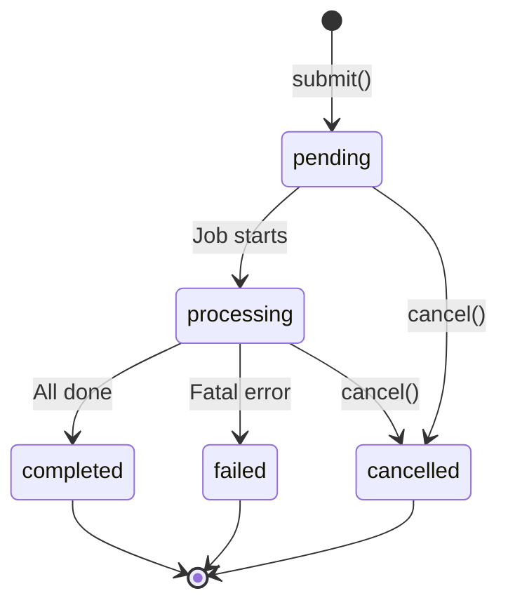

# Batch Processing

Process multiple requests efficiently with batch processing. Ideal for bulk operations, data processing pipelines, and scenarios where real-time responses aren't required.

## Overview

Batch processing allows you to:

- [x] Submit multiple requests at once
- [x] Process them asynchronously in the background
- [x] Retrieve results later
- [x] Track job status
- [x] Handle partial failures gracefully

!!! info "When to Use Batch Processing"
    - Processing large datasets
    - Non-interactive workloads
    - Cost optimization (some providers offer batch discounts)
    - Background tasks

---

## Basic Usage

```python title="basic_batch.py"
from nagents import BatchManager, BatchRequest

batch_manager = BatchManager(provider=provider)

# Create batch requests
requests = [
    BatchRequest(
        id="req-1",
        messages=[{"role": "user", "content": "Summarize: AI is transforming..."}]
    ),
    BatchRequest(
        id="req-2",
        messages=[{"role": "user", "content": "Summarize: Machine learning..."}]
    ),
    BatchRequest(
        id="req-3",
        messages=[{"role": "user", "content": "Summarize: Neural networks..."}]
    ),
]

# Submit batch job
job = await batch_manager.submit(requests)
print(f"Job ID: {job.id}")

# Check status
status = await batch_manager.get_status(job.id)
print(f"Status: {status}")

# Get results when complete
results = await batch_manager.get_results(job.id)
for result in results:
    print(f"{result.id}: {result.response[:100]}...")
```

---

## Batch Status

Jobs progress through these states:



| Status | Description |
|--------|-------------|
| `pending` | Job submitted, waiting to start |
| `processing` | Job is being processed |
| `completed` | All requests finished |
| `failed` | Job failed (fatal error) |
| `cancelled` | Job was cancelled |

---

## Polling for Results

```python title="polling.py"
import asyncio
from nagents import BatchStatus

job = await batch_manager.submit(requests)

while True:
    status = await batch_manager.get_status(job.id)

    match status:
        case BatchStatus.COMPLETED:
            print("Job completed!")
            break

        case BatchStatus.FAILED:
            raise Exception("Batch job failed")

        case BatchStatus.CANCELLED:
            print("Job was cancelled")
            break

        case _:
            print(f"Status: {status}, waiting...")
            await asyncio.sleep(5)  # (1)!

results = await batch_manager.get_results(job.id)
```

1. Poll every 5 seconds. Adjust based on expected job duration.

---

## Batch Store

Persist batch jobs and results for reliability:

```python title="persistent_batch.py" hl_lines="4-5 8"
from pathlib import Path
from nagents import BatchManager, BatchStore

# Create persistent store
store = BatchStore(Path("batches.db"))
await store.initialize()

batch_manager = BatchManager(
    provider=provider,
    store=store,  # Enable persistence
)

# Jobs and results are automatically persisted
job = await batch_manager.submit(requests)

# Even after restart, you can retrieve results
results = await batch_manager.get_results(job.id)
```

!!! tip "Production Use"
    Always use a `BatchStore` in production to:

    - Survive process restarts
    - Track job history
    - Enable debugging and auditing

---

## Cancelling Jobs

```python title="cancel_job.py"
job = await batch_manager.submit(requests)

# Cancel if needed
await batch_manager.cancel(job.id)

status = await batch_manager.get_status(job.id)
assert status == BatchStatus.CANCELLED
```

---

## Error Handling

Individual requests can fail without failing the entire batch:

```python title="error_handling.py"
results = await batch_manager.get_results(job.id)

successful = []
failed = []

for result in results:
    if result.error:
        failed.append(result)
        print(f":material-alert: Request {result.id} failed: {result.error}")
    else:
        successful.append(result)
        print(f":material-check: Request {result.id}: {result.response[:50]}...")

print(f"\nSummary: {len(successful)} succeeded, {len(failed)} failed")
```

---

## Complete Example

```python title="complete_batch.py" linenums="1"
import asyncio
from pathlib import Path
from nagents import (
    BatchManager,
    BatchRequest,
    BatchStore,
    BatchStatus,
    Provider,
    ProviderType,
)

async def process_documents(documents: list[str]) -> dict[str, str]:
    """Process multiple documents with batch API."""

    # Setup
    provider = Provider(
        provider_type=ProviderType.OPENAI_COMPATIBLE,
        api_key="sk-...",
        model="gpt-4o-mini",
    )

    store = BatchStore(Path("batch_jobs.db"))
    await store.initialize()

    batch_manager = BatchManager(provider=provider, store=store)

    # Create requests
    requests = [
        BatchRequest(
            id=f"doc-{i}",
            messages=[{
                "role": "user",
                "content": f"Summarize in one sentence: {doc}"
            }]
        )
        for i, doc in enumerate(documents)
    ]

    # Submit
    print(f"Submitting {len(requests)} requests...")
    job = await batch_manager.submit(requests)
    print(f"Job ID: {job.id}")

    # Wait for completion
    while True:
        status = await batch_manager.get_status(job.id)
        if status in (BatchStatus.COMPLETED, BatchStatus.FAILED, BatchStatus.CANCELLED):
            break
        print(f"  Status: {status}")
        await asyncio.sleep(2)

    if status != BatchStatus.COMPLETED:
        raise Exception(f"Job ended with status: {status}")

    # Collect results
    results = await batch_manager.get_results(job.id)

    summaries = {}
    for result in results:
        if result.error:
            summaries[result.id] = f"ERROR: {result.error}"
        else:
            summaries[result.id] = result.response

    return summaries


# Usage
async def main():
    documents = [
        "The quick brown fox jumps over the lazy dog...",
        "Artificial intelligence is transforming industries...",
        "Climate change poses significant challenges...",
    ]

    summaries = await process_documents(documents)

    print("\n--- Results ---")
    for doc_id, summary in summaries.items():
        print(f"{doc_id}: {summary}")


if __name__ == "__main__":
    asyncio.run(main())
```

---

## Best Practices

!!! success "Batch Processing Tips"

    1. **Use meaningful IDs** - Makes tracking and debugging easier
    2. **Implement retry logic** - Re-submit failed requests
    3. **Use persistent storage** - Always use `BatchStore` in production
    4. **Handle partial failures** - Check each result for errors
    5. **Set reasonable poll intervals** - Balance responsiveness vs. API calls
    6. **Consider rate limits** - Large batches may have provider-specific limits
