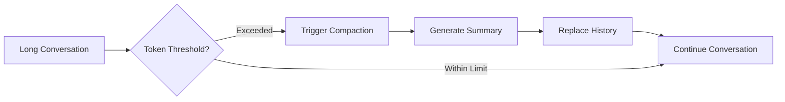
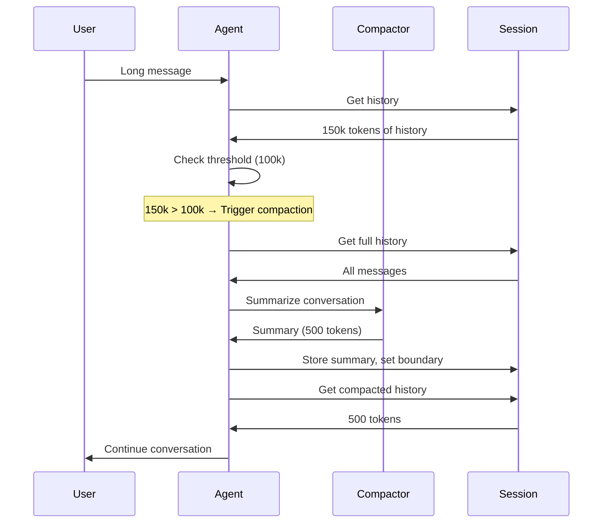

# Context Compaction

Context compaction automatically summarizes conversation history to stay within model context limits, enabling longer conversations without losing important context.

## Overview



When conversations grow long, the context window fills up. Compaction:

1. Checks if token count exceeds a threshold
2. Uses a separate "compactor" agent to summarize the conversation
3. Replaces the old history with a compact summary
4. Allows the conversation to continue

---

## Quick Start

Enable compaction with a token threshold:

```python title="basic_compaction.py"
from pathlib import Path
from nagents import Agent, Provider, ProviderType, SessionManager, Tokens

provider = Provider(
    provider_type=ProviderType.OPENAI_COMPATIBLE,
    api_key="sk-...",
    model="gpt-4o-mini",
)

session_manager = SessionManager(Path("sessions.db"))

agent = Agent(
    provider=provider,
    session_manager=session_manager,
    compactor="self",  # Use same agent for compaction (1)!
    compact_on=Tokens(input=100000, output=4000),  # (2)!
)
```

1. `"self"` means the main agent also performs compaction. Use a smaller/faster model for better performance.
2. Trigger compaction when input tokens approach 100k (leaving 4k for output).

---

## Compaction Triggers

### Token-Based Trigger

Trigger compaction based on token count:

```python title="token_trigger.py"
from nagents import Tokens

# Trigger when input exceeds 90k tokens (for 128k context models)
agent = Agent(
    provider=provider,
    session_manager=session_manager,
    compactor="self",
    compact_on=Tokens(input=90000, output=4000),
)
```

!!! tip "Token Threshold Guidelines"

    | Model Context | Recommended Input | Output Buffer |
    |---------------|-------------------|---------------|
    | 8k            | 6,000             | 2,000         |
    | 32k           | 28,000            | 4,000         |
    | 128k          | 100,000           | 4,000-8,000   |

### Message-Based Trigger

Trigger based on message count:

```python title="message_trigger.py"
from nagents import Messages

# Trigger after 100 messages
agent = Agent(
    provider=provider,
    session_manager=session_manager,
    compactor="self",
    compact_on=Messages(length=100),
)
```

### Disable Compaction

Turn off automatic compaction:

```python title="no_compaction.py"
agent = Agent(
    provider=provider,
    session_manager=session_manager,
    compactor="self",
    compact_on=None,  # (1)!
)
```

1. Use `None` to disable automatic compaction. You can still call `compact()` manually.

---

## Compactor Configuration

### Using the Main Agent

The simplest approach - use the same agent for compaction:

```python title="self_compactor.py"
agent = Agent(
    provider=provider,
    session_manager=session_manager,
    compactor="self",  # Use main agent
    compact_on=Tokens(input=50000, output=4000),
)
```

### Using Default Compactor

Use the built-in DEFAULT_COMPACTOR (lighter weight):

```python title="default_compactor.py"
from nagents import DEFAULT_COMPACTOR

agent = Agent(
    provider=provider,
    session_manager=session_manager,
    compactor=DEFAULT_COMPACTOR,  # (1)!
    compact_on=Tokens(input=50000, output=4000),
)
```

1. `DEFAULT_COMPACTOR` uses a simple summarization prompt.

### Using a Separate Compactor Agent

Use a smaller/faster model for compaction:

```python title="separate_compactor.py"
from nagents import Agent, Provider, ProviderType, Compactor

# Small, fast model for compaction
compaction_provider = Provider(
    provider_type=ProviderType.OPENAI_COMPATIBLE,
    api_key="sk-...",
    model="gpt-4o-mini",  # Fast and cheap (1)!
)

compactor = Compactor(
    provider=compaction_provider,
    system_prompt="Summarize this conversation concisely, preserving key facts and decisions.",
)

# Main agent uses larger model
main_provider = Provider(
    provider_type=ProviderType.OPENAI_COMPATIBLE,
    api_key="sk-...",
    model="gpt-4o",  # Powerful for main tasks (2)!
)

agent = Agent(
    provider=main_provider,
    session_manager=session_manager,
    compactor=compactor,
    compact_on=Tokens(input=50000, output=4000),
)
```

1. Use a smaller model for summarization to save costs.
2. Use a larger model for the main conversation tasks.

---

## Manual Compaction

### Trigger Compaction During Run

Request compaction before the next generation cycle:

```python title="trigger_compaction.py" hl_lines="12-15"
from nagents import ToolResultEvent

# Track token usage during run
async for event in agent.run("What's the context?", session_id="user-123"):
    if isinstance(event, ToolResultEvent):
        # Check if context is getting large
        if event.usage.session and event.usage.session.prompt_tokens > 50000:
            # Request compaction before next generation
            agent.trigger_compaction()  # (1)!
            print("Compaction triggered for next round")

    # Handle other events...
```

1. Compaction happens BEFORE the next model call.

### Compact Outside Run

Manually compact a session:

```python title="manual_compact.py"
# Compact a session before starting a conversation
result = await agent.compact("user-123")
print(f"Compacted: {result.original_message_count} -> {result.new_message_count} messages")
print(f"Summary: {result.summary_text[:200]}...")

# Continue with conversation
async for event in agent.run("Continue...", session_id="user-123"):
    ...
```

The `compact()` method returns a `CompactionDoneEvent` with:

| Field | Description |
|-------|-------------|
| `original_message_count` | Messages before compaction |
| `new_message_count` | Messages after (usually 1) |
| `original_token_count` | Estimated tokens before |
| `summary_tokens` | Tokens in the summary |
| `summary_text` | The generated summary |
| `session_id` | Session that was compacted |
| `compaction_session_id` | Session used for compaction |

---

## Compaction Events

Monitor compaction during run:

```python title="compaction_events.py"
from nagents import CompactionStartedEvent, CompactionDoneEvent

async for event in agent.run("Long conversation...", session_id="user-123"):
    if isinstance(event, CompactionStartedEvent):
        print(f"Compaction started: {event.message_count} messages")
        print(f"Estimated tokens: {event.estimated_tokens}")

    elif isinstance(event, CompactionDoneEvent):
        print(f"Compaction complete!")
        print(f"  Before: {event.original_message_count} messages, {event.original_token_count} tokens")
        print(f"  After: {event.new_message_count} messages, {event.summary_tokens} tokens")
        print(f"  Compactor: {event.compactor_used}")
```

---

## Custom Compaction Prompt

Customize the summarization behavior:

```python title="custom_prompt.py"
from nagents import Compactor

compactor = Compactor(
    provider=provider,
    system_prompt="""You are a conversation summarizer. Create a concise summary that:

1. Preserves all key facts and decisions
2. Maintains user preferences and constraints
3. Notes any unresolved questions
4. Keeps important context for future messages

Be thorough but concise. Focus on information needed for future responses.""",
)

agent = Agent(
    provider=main_provider,
    session_manager=session_manager,
    compactor=compactor,
    compact_on=Tokens(input=80000, output=4000),
)
```

---

## How It Works

### Compaction Flow



### Session History After Compaction

Before compaction:
```
Session: user-123
├── Message 1: "Hello" (user)
├── Message 2: "Hi there!" (assistant)
├── Message 3: "What's the weather?" (user)
├── ... (100+ more messages)
└── Message 150: "Thanks!" (user)
```

After compaction:
```
Session: user-123
└── compaction_summary: "Conversation summary: User asked about weather,
    discussed travel plans, preferred morning meetings..."
```

The next `get_history()` call returns just the summary message.

---

## Best Practices

!!! success "Compaction Tips"

    1. **Set appropriate thresholds** - Leave buffer for model output
    2. **Use smaller models** - Faster/cheaper for summarization
    3. **Customize prompts** - Tailor summaries to your use case
    4. **Monitor events** - Track when compaction happens
    5. **Test thoroughly** - Ensure summaries preserve needed context

!!! warning "Context Loss"

    Compaction is lossy compression. Some details will be lost. Test that:

    - Important facts are preserved
    - User preferences are retained
    - Task context remains clear

---

## Examples

See the following examples:

| Example | Description |
|----------|-------------|
| `01_default_compactor.py` | Basic compaction with DEFAULT_COMPACTOR |
| `02_self_compaction.py` | Using the main agent for compaction |
| `03_custom_compactor.py` | Separate compactor with custom model |
| `04_no_compaction.py` | Disabling automatic compaction |
| `05_trigger_compaction.py` | Manual triggering during run |
| `06_manual_compact.py` | Calling compact() outside run |

---

## API Reference

### Compaction Triggers

::: nagents.compactor.Tokens
    options:
        show_source: true

::: nagents.compactor.Messages
    options:
        show_source: true

### Compaction Events

::: nagents.events.types.CompactionStartedEvent
    options:
        show_source: true

::: nagents.events.types.CompactionDoneEvent
    options:
        show_source: true

### Compactor

::: nagents.compactor.Compactor
    options:
        show_source: true

### Agent Compaction Methods

::: nagents.agent.Agent.compact
    options:
        show_source: true

::: nagents.agent.Agent.trigger_compaction
    options:
        show_source: true
