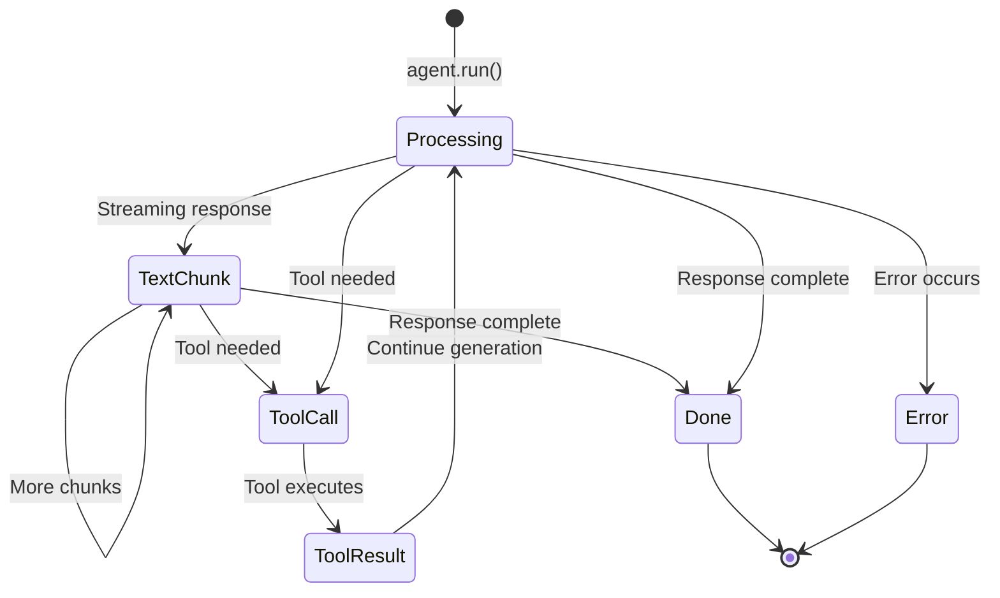

# Events

nagents uses an event-based streaming architecture. Events are emitted during agent execution to provide real-time updates on generation progress, tool calls, and completion.

## Event Types Overview

| Event | Description | When Emitted |
|-------|-------------|--------------|
| `TextChunkEvent` | Streaming text chunk | During streaming response |
| `TextDoneEvent` | Complete text | Non-streaming mode |
| `ToolCallEvent` | Model is calling a tool | Before tool execution |
| `ToolResultEvent` | Tool execution completed | After tool execution |
| `ErrorEvent` | Error occurred | On errors |
| `DoneEvent` | Generation complete | At the end |

---

## Base Event

All events inherit from `Event` and include common fields:

```python
@dataclass
class Event:
    type: EventType         # Type discriminator
    timestamp: datetime     # When the event occurred
    usage: Usage           # Token usage (always present)
```

!!! info "Usage is Never None"
    The `usage` field is always present on events. During streaming, intermediate events may have zero counts until the final `DoneEvent`.

---

## Usage Information

Track token usage for cost monitoring and optimization:

```python
@dataclass
class TokenUsage:
    prompt_tokens: int      # Input tokens
    completion_tokens: int  # Output tokens
    total_tokens: int       # Sum of above

@dataclass
class Usage:
    prompt_tokens: int          # Current generation
    completion_tokens: int      # Current generation
    total_tokens: int           # Current generation
    session: TokenUsage | None  # Cumulative across tool rounds
```

```python title="usage_tracking.py"
async for event in agent.run("Hello"):
    if isinstance(event, DoneEvent):
        print(f"This request: {event.usage.total_tokens} tokens")
        if event.usage.session:
            print(f"Session total: {event.usage.session.total_tokens} tokens")
```

---

## TextChunkEvent

Emitted for each streaming text chunk:

```python
@dataclass
class TextChunkEvent(Event):
    chunk: str  # The text chunk
```

```python title="streaming.py"
async for event in agent.run("Tell me a story"):
    if isinstance(event, TextChunkEvent):
        print(event.chunk, end="", flush=True)  # (1)!
```

1. Use `flush=True` to ensure immediate output during streaming.

---

## TextDoneEvent

Emitted when complete text is available (non-streaming mode):

```python
@dataclass
class TextDoneEvent(Event):
    text: str  # Complete text
```

```python title="non_streaming.py"
async for event in agent.run("Hello", stream=False):
    if isinstance(event, TextDoneEvent):
        print(event.text)
```

---

## ToolCallEvent

Emitted when the model calls a tool:

```python
@dataclass
class ToolCallEvent(Event):
    id: str               # Unique call identifier
    name: str             # Tool function name
    arguments: dict       # Tool arguments
```

```python title="tool_call.py"
if isinstance(event, ToolCallEvent):
    print(f"Calling {event.name}")
    print(f"  ID: {event.id}")
    print(f"  Args: {event.arguments}")
```

---

## ToolResultEvent

Emitted after tool execution:

```python
@dataclass
class ToolResultEvent(Event):
    id: str               # Matches ToolCallEvent.id
    name: str             # Tool function name
    result: Any           # Tool return value (if successful)
    error: str | None     # Error message (if failed)
    duration_ms: float    # Execution time in milliseconds
```

```python title="tool_result.py"
if isinstance(event, ToolResultEvent):
    if event.error:
        print(f":material-alert: {event.name} failed: {event.error}")
    else:
        print(f":material-check: {event.name} returned: {event.result}")
        print(f"  Duration: {event.duration_ms:.1f}ms")
```

---

## ErrorEvent

Emitted when an error occurs:

```python
@dataclass
class ErrorEvent(Event):
    message: str           # Error message
    code: str | None       # Error code (provider-specific)
    recoverable: bool      # Can the conversation continue?
```

```python title="error_handling.py"
if isinstance(event, ErrorEvent):
    print(f"Error: {event.message}")
    if event.code:
        print(f"Code: {event.code}")
    if not event.recoverable:
        print("Cannot continue conversation")
```

---

## DoneEvent

Emitted when generation is complete:

```python
@dataclass
class DoneEvent(Event):
    final_text: str        # Complete response text
    session_id: str | None # Session ID used
```

```python title="done_event.py"
if isinstance(event, DoneEvent):
    print(f"\n--- Generation Complete ---")
    print(f"Response length: {len(event.final_text)} characters")
    print(f"Session: {event.session_id}")
    print(f"Tokens used: {event.usage.total_tokens}")
```

---

## Complete Example

Here's a comprehensive example handling all event types:

```python title="complete_event_handling.py" linenums="1"
from nagents import (
    Agent,
    TextChunkEvent,
    TextDoneEvent,
    ToolCallEvent,
    ToolResultEvent,
    ErrorEvent,
    DoneEvent,
)

async def process_response(agent: Agent, message: str):
    """Process agent response with full event handling."""

    async for event in agent.run(message):
        match event:
            case TextChunkEvent(chunk=chunk):
                # Streaming text
                print(chunk, end="", flush=True)

            case TextDoneEvent(text=text):
                # Non-streaming complete text
                print(text)

            case ToolCallEvent(name=name, arguments=args):
                # Tool being called
                print(f"\n[Calling {name}...]")

            case ToolResultEvent(name=name, result=result, error=error, duration_ms=ms):
                # Tool completed
                if error:
                    print(f"[{name} failed: {error}]")
                else:
                    print(f"[{name} returned in {ms:.0f}ms]")

            case ErrorEvent(message=msg, recoverable=can_continue):
                # Error occurred
                print(f"\n[Error: {msg}]")
                if not can_continue:
                    break

            case DoneEvent(final_text=text, usage=usage):
                # All done
                print(f"\n--- Done ---")
                print(f"Response: {len(text)} chars")
                print(f"Tokens: {usage.total_tokens}")
                if usage.session:
                    print(f"Session total: {usage.session.total_tokens}")
```

---

## Pattern Matching

Python's pattern matching makes event handling elegant:

=== "Match Statement (Python 3.10+)"

    ```python
    async for event in agent.run(message):
        match event:
            case TextChunkEvent(chunk=c):
                print(c, end="")
            case DoneEvent(usage=u):
                print(f"\nTokens: {u.total_tokens}")
    ```

=== "isinstance Checks"

    ```python
    async for event in agent.run(message):
        if isinstance(event, TextChunkEvent):
            print(event.chunk, end="")
        elif isinstance(event, DoneEvent):
            print(f"\nTokens: {event.usage.total_tokens}")
    ```

=== "Type-based Dispatch"

    ```python
    handlers = {
        TextChunkEvent: lambda e: print(e.chunk, end=""),
        DoneEvent: lambda e: print(f"\nTokens: {e.usage.total_tokens}"),
    }

    async for event in agent.run(message):
        handler = handlers.get(type(event))
        if handler:
            handler(event)
    ```

---

## Event Flow Diagram



---

## Best Practices

!!! success "Event Handling Tips"

    1. **Always handle `ErrorEvent`** - Don't let errors go unnoticed
    2. **Use `flush=True` for streaming** - Ensures immediate output
    3. **Track usage on `DoneEvent`** - For cost monitoring
    4. **Save `session_id`** - If you want to continue the conversation later
    5. **Handle `recoverable` flag** - Know when to retry vs. abort
