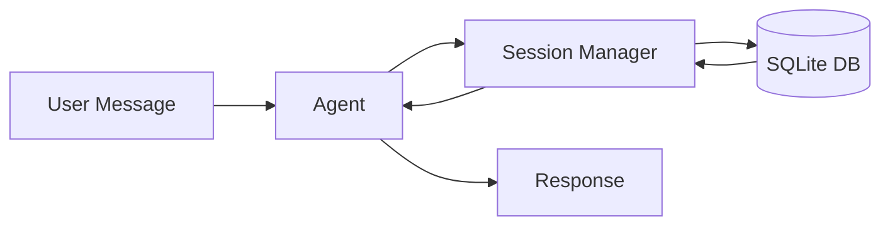
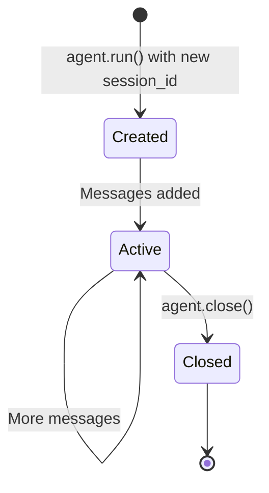

# Sessions

Sessions enable conversation persistence across multiple interactions, allowing your agent to maintain context and remember previous messages.

## Overview



---

## Session Manager

!!! important "Required Component"
    The `SessionManager` is **required** when creating an Agent. It handles all conversation persistence.

Create a session manager with a SQLite database:

```python title="session_setup.py"
from pathlib import Path
from nagents import Agent, SessionManager, Provider, ProviderType

# Create session manager
session_manager = SessionManager(Path("sessions.db"))  # (1)!

# Create agent with session manager
agent = Agent(
    provider=provider,
    session_manager=session_manager,
)
```

1. The database file will be created automatically if it doesn't exist.

---

## Using Sessions

Specify a `session_id` to maintain conversation history:

```python title="session_usage.py" hl_lines="4 11"
# First interaction
async for event in agent.run(
    "My name is Alice",
    session_id="user-123",
):
    ...

# Later interaction (same session)
async for event in agent.run(
    "What's my name?",
    session_id="user-123",
):
    # Agent remembers: "Your name is Alice"
    ...
```

!!! tip "Session ID Best Practices"
    Use meaningful, consistent session IDs:

    - User-based: `user-{user_id}`
    - Conversation-based: `conv-{uuid}`
    - Thread-based: `thread-{thread_id}`

---

## Auto-Generated Sessions

If no `session_id` is provided, a new session is created automatically:

```python title="auto_session.py"
async for event in agent.run("Hello"):
    if isinstance(event, DoneEvent):
        print(f"Session ID: {event.session_id}")
        # Save this ID to continue the conversation later
```

---

## Session Data

Sessions store:

- [x] **Conversation messages** - User, assistant, tool calls/results
- [x] **Session metadata** - created_at, updated_at, user_id
- [x] **System prompt** - At session creation time

??? info "Database Schema"

    ```sql
    CREATE TABLE sessions (
        id TEXT PRIMARY KEY,
        user_id TEXT,
        created_at TIMESTAMP,
        updated_at TIMESTAMP,
        system_prompt TEXT
    );

    CREATE TABLE messages (
        id INTEGER PRIMARY KEY,
        session_id TEXT REFERENCES sessions(id),
        role TEXT,
        content TEXT,
        tool_calls TEXT,  -- JSON
        created_at TIMESTAMP
    );
    ```

---

## User Association

Associate sessions with users for multi-user applications:

```python title="user_sessions.py" hl_lines="4"
async for event in agent.run(
    "Hello",
    session_id="conversation-456",
    user_id="user-123",
):
    ...
```

This allows you to:

- Query all sessions for a user
- Implement user-specific context
- Track usage per user

---

## Session Lifecycle



```python title="lifecycle.py"
from pathlib import Path
from nagents import Agent, SessionManager

async def main():
    session_manager = SessionManager(Path("sessions.db"))

    # Initialize (creates tables if needed)
    await session_manager.initialize()  # (1)!

    agent = Agent(provider=provider, session_manager=session_manager)

    # Sessions are automatically created/updated during agent.run()
    async for event in agent.run("Hello", session_id="test"):
        ...

    # Close when done
    await agent.close()  # (2)!
```

1. Called automatically by Agent, but can be called explicitly.
2. Also closes the session manager.

---

## Multiple Sessions

Handle multiple concurrent sessions easily:

```python title="multi_session.py"
# User A's conversation
async for event in agent.run(
    "I like pizza",
    session_id="user-a-session",
):
    ...

# User B's conversation (completely separate)
async for event in agent.run(
    "I prefer sushi",
    session_id="user-b-session",
):
    ...

# Back to User A (remembers pizza preference)
async for event in agent.run(
    "What food do I like?",
    session_id="user-a-session",
):
    # Agent responds about pizza
    ...
```

---

## Session Isolation

Each session is completely isolated:

```python title="isolation_example.py"
# Session 1: Set a name
await run_agent("My name is Alice", session_id="session-1")

# Session 2: Different conversation
await run_agent("My name is Bob", session_id="session-2")

# Session 1: Remembers Alice
await run_agent("What's my name?", session_id="session-1")
# Response: "Your name is Alice"

# Session 2: Remembers Bob
await run_agent("What's my name?", session_id="session-2")
# Response: "Your name is Bob"
```

---

## Example: Chat Application

Here's a complete example of a session-based chat application:

```python title="chat_app.py" linenums="1"
import asyncio
from pathlib import Path
from nagents import Agent, Provider, ProviderType, SessionManager, DoneEvent

async def chat(session_id: str):
    """Run an interactive chat session."""

    provider = Provider(
        provider_type=ProviderType.OPENAI_COMPATIBLE,
        api_key="sk-...",
        model="gpt-4o-mini",
    )

    session_manager = SessionManager(Path("chat.db"))

    agent = Agent(
        provider=provider,
        session_manager=session_manager,
        system_prompt="You are a helpful assistant. Be concise.",
    )

    print(f"Chat session: {session_id}")
    print("Type 'quit' to exit\n")

    while True:
        user_input = input("You: ").strip()
        if user_input.lower() == "quit":
            break

        print("Assistant: ", end="")
        async for event in agent.run(user_input, session_id=session_id):
            if hasattr(event, 'chunk'):
                print(event.chunk, end="", flush=True)
        print()  # newline

    await agent.close()
    print("\nGoodbye!")

if __name__ == "__main__":
    import sys
    session_id = sys.argv[1] if len(sys.argv) > 1 else "default"
    asyncio.run(chat(session_id))
```

Usage:

```bash
# Start a new session
python chat_app.py my-session

# Continue the same session later
python chat_app.py my-session
```

---

## Best Practices

!!! success "Session Management Tips"

    1. **Use meaningful session IDs** - Makes debugging easier
    2. **Associate with users** - Use `user_id` for multi-user apps
    3. **Handle session cleanup** - Consider implementing session expiration
    4. **Don't store sensitive data** - Sessions are stored in SQLite
    5. **Close properly** - Always call `agent.close()` when done
