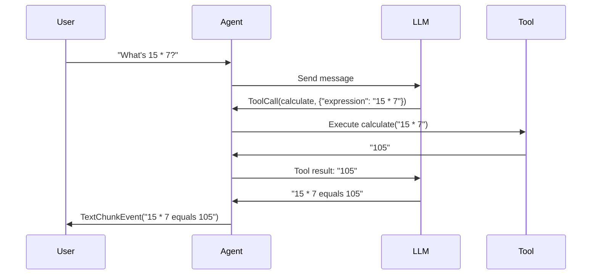

# Tools

Tools allow your agent to call Python functions during conversations, enabling it to perform actions, fetch data, and interact with external systems.

## Defining Tools

Any Python function can be used as a tool. The function's **docstring** and **type hints** are used to generate the tool schema automatically:

```python title="tools.py"
def get_weather(city: str) -> str:
    """Get the current weather for a city.

    Args:
        city: The name of the city to get weather for.
    """
    # Your implementation
    return f"Weather in {city}: Sunny, 22°C"

def calculate(expression: str) -> str:
    """Evaluate a mathematical expression.

    Args:
        expression: A mathematical expression like "2 + 2" or "10 * 5"
    """
    return str(eval(expression))
```

!!! tip "Tool Documentation Best Practices"
    1. **Always include docstrings** - The LLM uses them to understand when to call the tool
    2. **Use type hints** - Required for proper schema generation
    3. **Document parameters** - Use the `Args:` section in Google-style docstrings
    4. **Be descriptive** - Explain what the tool does and when to use it

---

## Registering Tools

Pass tools when creating the agent:

```python hl_lines="7"
from pathlib import Path
from nagents import Agent, SessionManager

agent = Agent(
    provider=provider,
    session_manager=SessionManager(Path("sessions.db")),
    tools=[get_weather, calculate],
)
```

---

## Tool Execution Flow



The execution flow:

1. Agent receives user message
2. Model decides to call a tool
3. `ToolCallEvent` is emitted
4. Tool function is executed
5. `ToolResultEvent` is emitted with result
6. Model continues with tool result

---

## Handling Tool Events

```python title="tool_events.py"
from nagents import ToolCallEvent, ToolResultEvent, TextChunkEvent

async for event in agent.run("What's 15 * 7?"):
    match event:
        case ToolCallEvent(name=name, arguments=args):
            print(f":material-tools: Calling: {name}({args})")

        case ToolResultEvent(result=result, duration_ms=ms):
            print(f":material-check: Result: {result} ({ms:.0f}ms)")

        case TextChunkEvent(chunk=chunk):
            print(chunk, end="")
```

---

## Async Tools

Async functions are fully supported:

```python title="async_tools.py"
import aiohttp

async def fetch_data(url: str) -> str:
    """Fetch data from a URL.

    Args:
        url: The URL to fetch data from.
    """
    async with aiohttp.ClientSession() as session:
        async with session.get(url) as response:
            return await response.text()

async def query_database(query: str) -> str:
    """Execute a database query.

    Args:
        query: The SQL query to execute.
    """
    # Async database operations
    result = await db.execute(query)
    return str(result)

agent = Agent(
    provider=provider,
    session_manager=session_manager,
    tools=[fetch_data, query_database],
)
```

!!! info "Sync vs Async"
    Both sync and async functions work seamlessly. nagents automatically handles the execution context.

---

## Tool Errors

If a tool raises an exception, it's captured and sent to the model:

```python title="error_handling.py"
def risky_operation(param: str) -> str:
    """A tool that might fail.

    Args:
        param: A required parameter.
    """
    if not param:
        raise ValueError("param cannot be empty")
    return f"Success: {param}"
```

The `ToolResultEvent` will have `error` set instead of `result`:

```python
async for event in agent.run("Call risky_operation"):
    if isinstance(event, ToolResultEvent):
        if event.error:
            print(f":material-alert: Tool failed: {event.error}")
        else:
            print(f":material-check: Result: {event.result}")
```

---

## Handling Tool Hallucinations

Sometimes LLMs may attempt to call tools that don't exist ("hallucinated" tools).

=== "Default: Self-Correct"

    By default, nagents returns an error message to the LLM listing available tools:

    ```python
    agent = Agent(
        provider=provider,
        session_manager=session_manager,
        tools=[get_weather],  # Only get_weather is available
    )
    # If LLM tries to call "search_database", it receives:
    # "Unknown tool: search_database. Available tools: get_weather"
    # The LLM can then retry with a valid tool
    ```

=== "Strict: Raise Exception"

    For stricter control, raise an exception:

    ```python
    from nagents import Agent, ToolHallucinationError

    agent = Agent(
        provider=provider,
        session_manager=session_manager,
        tools=[get_weather],
        fail_on_invalid_tool=True,
    )

    try:
        async for event in agent.run("Search for restaurants"):
            ...
    except ToolHallucinationError as e:
        print(f"LLM tried to call: {e.tool_name}")
        print(f"Available tools: {e.available_tools}")
    ```

!!! warning "When to Use Strict Mode"
    Use `fail_on_invalid_tool=True` when:

    - You need deterministic behavior
    - Tool hallucinations indicate a problem with your prompts
    - You want to catch and handle these cases explicitly

---

## Complex Parameters

Tools can have complex parameter types:

```python title="complex_params.py"
from typing import Optional

def search(
    query: str,
    limit: int = 10,
    filters: Optional[dict] = None,
) -> str:
    """Search for items.

    Args:
        query: Search query string.
        limit: Maximum results to return (default: 10).
        filters: Optional filters to apply.
    """
    results = perform_search(query, limit, filters)
    return str(results)

def create_event(
    title: str,
    date: str,
    attendees: list[str],
    location: Optional[str] = None,
) -> str:
    """Create a calendar event.

    Args:
        title: Event title.
        date: Event date in YYYY-MM-DD format.
        attendees: List of attendee email addresses.
        location: Optional event location.
    """
    ...
```

??? info "Supported Parameter Types"

    | Type | Description |
    |------|-------------|
    | `str` | String values |
    | `int` | Integer values |
    | `float` | Floating point values |
    | `bool` | Boolean values |
    | `list[T]` | Arrays of type T |
    | `dict` | JSON objects |
    | `Optional[T]` | Optional parameters |
    | Default values | Parameters with defaults are optional |

---

## Best Practices

!!! success "Tool Design Guidelines"

    1. **Single Responsibility** - Each tool should do one thing well
    2. **Clear Names** - Use descriptive function names like `get_weather`, not `gw`
    3. **Detailed Docstrings** - The LLM relies on these to understand the tool
    4. **Return Strings** - Return human-readable strings for best LLM comprehension
    5. **Handle Errors Gracefully** - Raise meaningful exceptions with clear messages
    6. **Keep It Simple** - Avoid overly complex parameter structures

??? example "Well-Designed Tool Example"

    ```python
    def search_products(
        query: str,
        category: Optional[str] = None,
        max_price: Optional[float] = None,
        in_stock_only: bool = True,
    ) -> str:
        """Search for products in the catalog.

        Use this tool when the user wants to find products by name,
        category, or other criteria.

        Args:
            query: Search terms (e.g., "red shoes", "wireless headphones").
            category: Optional category filter (e.g., "electronics", "clothing").
            max_price: Maximum price in USD. Omit for no price limit.
            in_stock_only: Only return products currently in stock (default: True).

        Returns:
            A formatted list of matching products with names, prices, and availability.
        """
        products = catalog.search(
            query=query,
            category=category,
            max_price=max_price,
            in_stock=in_stock_only,
        )

        if not products:
            return f"No products found matching '{query}'."

        lines = [f"Found {len(products)} products:"]
        for p in products[:10]:  # Limit results
            status = "In Stock" if p.in_stock else "Out of Stock"
            lines.append(f"- {p.name}: ${p.price:.2f} ({status})")

        return "\n".join(lines)
    ```
